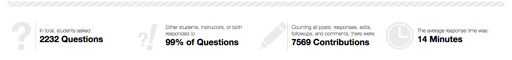
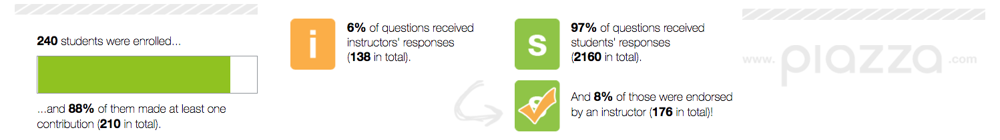
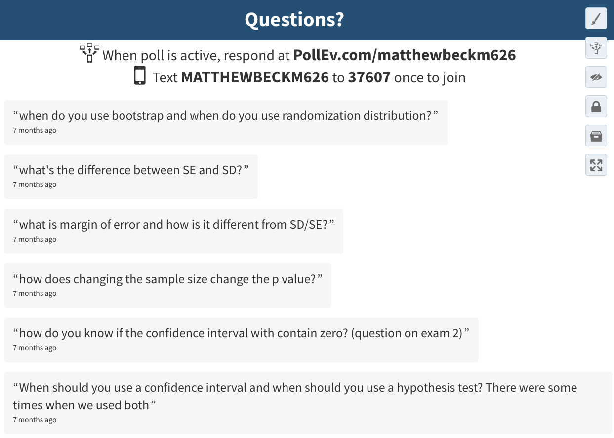

```{r setup, include=FALSE}
knitr::opts_chunk$set(echo = TRUE)
```

# GAISE Remarks specific to large classes

## 1992 Cobb Report (pre-GAISE)
- Little or no strategic guidance specific to large class environment

## 2005 GAISE College Report
- **Recommendation 4: Foster active learning (p. 18-19)**
    - "...large classes provid[e] opportunities for large sample sizes for student-generated data."
    - "...have students work in pairs, rather than larger groups."
    - "separate lab/discussion section for activities, if possible."

- **Recommendation 6: Use assessments to improve and evaluate student learning (p. 21-22)**
    - "Use small group projects instead of individual projects."
    - "Use peer review of projects to provide feedback and improve projects before grading."
    - "Use discussion sections for student presentations."
    - "focus on choosing good interpretations of graphs or selecting appropriate statistical procedures."


## 2016 GAISE College Report
- **Recommendation 4: Foster active learning (p. 18-19)**
    - Acknowledged and deferred to Appendix F.

- **Recommendation 6: Use assessments to improve and evaluate student learning (p. 21-23)**
    - "Use small group projects instead of individual projects."
    - "Use peer review of projects to provide feedback and improve projects before grading."
    - "Use discussion sections for student presentations."
    - "Incorporate real-time response systems (e.g., clickers)..."

- **Appendix D: Examples of Using Technology**
    - Discussion of real-time response (i.e. clicker) utilization 

- **Appendix E: Examples of Assessment Items**
    - "[W]e want students to interpret results more than we want them to produce results... However sometimes the practicalities of teaching a large class mean that an appropriate exam question might be a multiple choice item that does not as for explanation."

- **Appendix F: Learning Environments**
    - Face-to-Face Courses >> Large Classes: (p. 132-134)
        - active/cooperative learning can work in large classes (Carbone, 1998)
        - just choose activities judiciously (Gelman & Nolan, 2002)
        - embed TA's or advanced students for group supervision (Davidson, 1990)
        - "Example #1" >> modified think-pair-share (Blumberg, 2015)
        - "Example #2" >> think-pair-share then randomly call on a student to report
        - "Example #3: Data Collection Using Class Polling" >> see Appendix D for more
        - "Example #4: Using Online Surveys to Maximize Class Time" >> see Appendix D for more

# Some Additional Ideas

## Clickers  
- Incentive to participate
    - full credit for 50% participation (2% of class grade)
    - pro-rated extra credit for additional participation (up to 2% of class grade; planning 1% next time)
    - this was enough incentive for strong attendance & participation
- No incentive for accuracy except to show results
- Show/tell students when it's a close race; encourage them to reconcile with others
- Consider not publishing answers to clicker Q's (Students have to be there and pay attention)

## Large sample size for class data collections   
- In class investigations (e.g. M&M activity)
    - Google Sheet for instant data collection 
    - Instructor can quickly clean the data (filter out spaces & obvious typos)
    - Instrucor or students copy/paste data into software for analysis
    - Large sample size is reliable for representing key features (e.g. CLT)
    - Even anomalies are useful (e.g. outliers from wrong units & typos vs. legitimate extreme obs.)
- Polling with randomized response surveys (https://en.wikipedia.org/wiki/Randomized_response)
    - Ask gutsy questions, get anonymous answers (haven't tried this personally)

## Crowd-source Q&A
- Student incentive to both ask and answer questions regularly (2 contributions/wk)
    - Some "training" is needed early in semester to set the habit
    - Students generally do a nice job with content questions
    - Questions are answered **much** more quickly
    - Most syllabus and logistical questions are easily resolved
- Instructor & TAs mainly just step in for
    - Unresolved issues
    - Exam review time

 

 

\newpage

## Live SMS inbox
- Students can write in anonymously using a website or text message
- Students are still encouraged to ask questions in class since many SMS questions go unanswered
- Monitored periodically during "think-pair-share" or clicker questions
- There will be nonsense mixed in, so not good for the big screen
- Alternatively, a TA could monitor the feed & ask common questions
- Bonus: any errors or typos spark a flurry of activity so you catch them quickly

 


\newpage

## Exams & Projects  
- Exams 
    - 2 x 50min in-class midterms; 1 x 110min final
    - 15%, 20%, & 25% of final grade, respectively
    - Mostly short answer & select-response; a few fill-in-blank; occasional marking a plot/figure 
    - Questions walk through (usually 2) statistical investigations of real data
    - Several tool selection questions based on provided research question (no analysis)
- Project (credit to Michael Bulmer for most of the guidance here)
    - 15% of final grade
    - Uses *The Islands* by Michael Bulmer (U.S. mirror: http://theislands.umn.edu/login.php)
    - Students design a study, collect data, analyze data, write report
    - Provided guidance (per Michael Bulmer): 
        - Lab activity with example of an experiment and an observational study using the Islands
        - Catalogue of the variable types & combinations we have studied
        - Complete scoring rubric
    - Groups of 1-4 permitted
    - Report Structure (word limits)
        - Introduction (100 words)
        - Methods (250 words)
        - Results (250 words; 1-2 Figures)
        - Conclusions (100 words)
    - Word limits are intentionally tight
        - Students still have to do all the necessary statistical thinking to complete the project
        - Students have to write in concise technical language
        - Manageable for grading


# References

